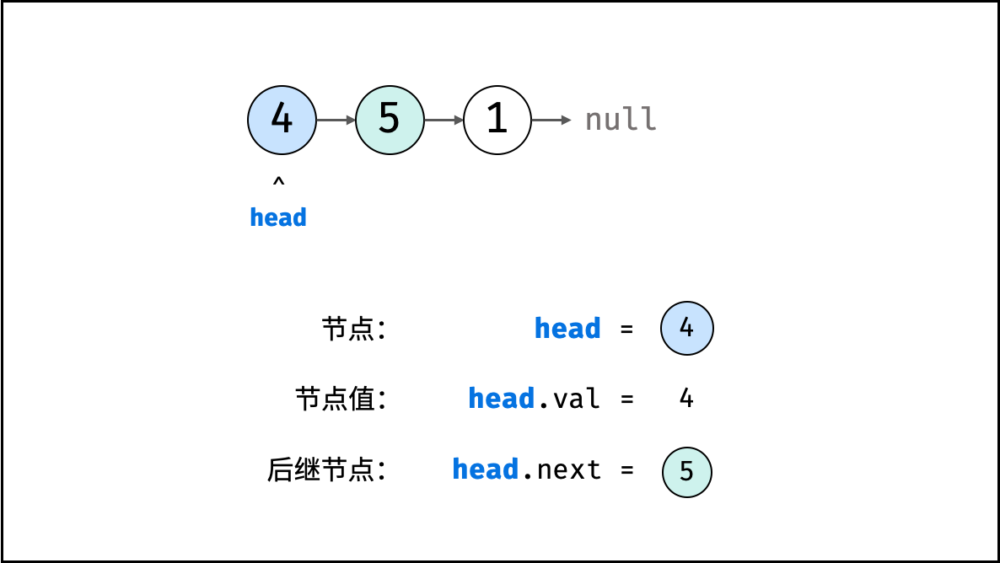

链表以节点为单位，每个元素都是一个独立对象，在内存空间的存储是非连续的。   
链表的节点对象具有两个成员变量："值 val"(存储元素的数据域，内存空间)，"后继节点引用 next"（指向下一个结点地址的指针域）。   
适用场景：数据量较小，需要频繁增加，删除操作的场景
    
```python
class ListNode:
    def __init__(self, x):
        self.val = x     # 节点值
        self.next = None # 后继节点引用

# 实例化节点
n1 = ListNode(4) # 节点 head
n2 = ListNode(5)
n3 = ListNode(1)

# 构建引用指向
n1.next = n2
n2.next = n3
```

