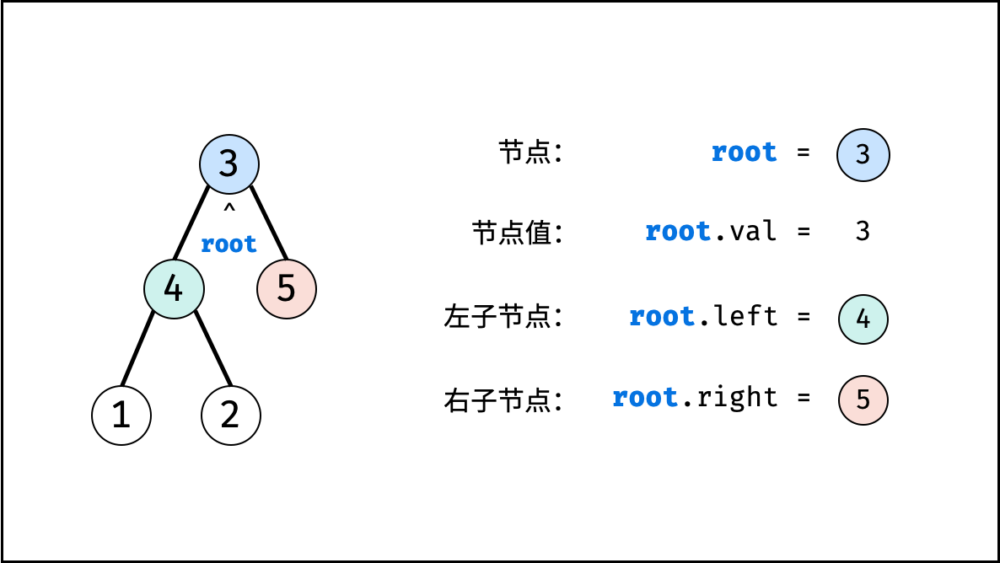

树是一种非线性数据结构，根据子节点数量可分为 "二叉树" 和 "多叉树"，最顶层的节点称为 "根节点 root" 。   
以二叉树为例，每个节点包含三个成员变量："值 val"、"左子节点 left"、"右子节点 right"。

```python
class TreeNode:
    def __init__(self, x):
        self.val = x      # 节点值
        self.left = None  # 左子节点
        self.right = None # 右子节点

# 初始化节点
n1 = TreeNode(3) # 根节点 root
n2 = TreeNode(4)
n3 = TreeNode(5)
n4 = TreeNode(1)
n5 = TreeNode(2)

# 构建引用指向
n1.left = n2
n1.right = n3
n2.left = n4
n2.right = n5
```

