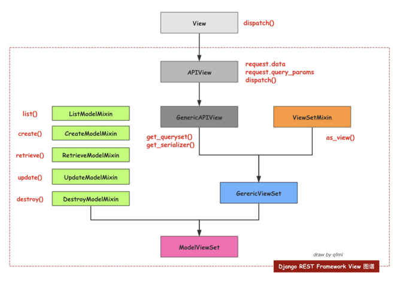
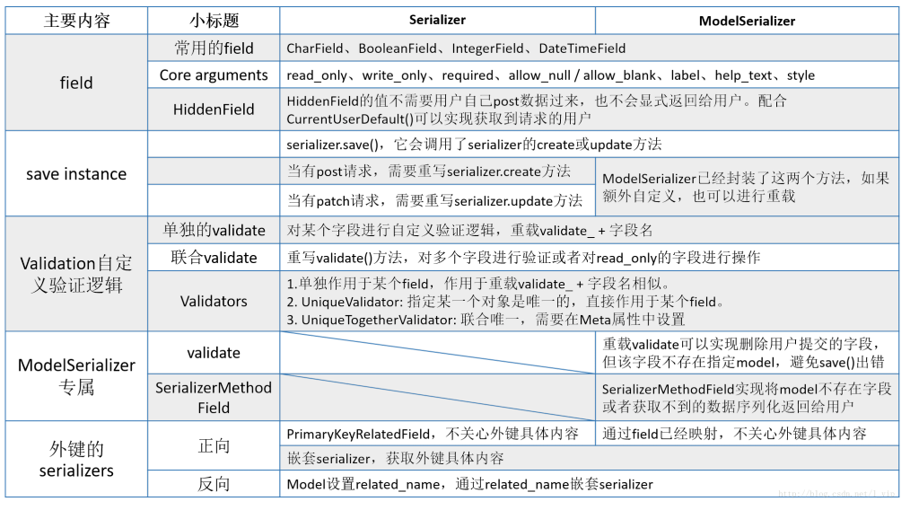

### restfull规范
```
一种软件架构风格、设计风格，而不是标准，只是提供了一组设计原则和约束条件,规定如何编写以及如何设置返回值、状态 码等信息
一、域名
    1.应该尽量将API部署在专用域名之下。https://api.example.com
    2.如果确定API很简单，不会有进一步扩展，可以考虑放在主域名下。https://example.org/api/
二、版本
    应该将API的版本号放入URL。https://api.example.com/v1/ （另一种做法是，将版本号放在HTTP头信息中，但不如放入URL方便和直观）
三、路径
    视网络上任何东西都是资源，均使用名词表示（可复数）
        GET ：从服务器取出资源（一项或多项）
        POST：在服务器新建一个资源 
        PUT：在服务器更新资源（客户端提供改变后的完整资源） 
        PATCH：在服务器更新资源（客户端提供改变的属性） 
        DELETE ：从服务器删除资源
四、过滤
    https://api.example.com/v1/zoos?limit=10：指定返回记录的数量 
    https://api.example.com/v1/zoos?offset=10：指定返回记录的开始位置 
    https://api.example.com/v1/zoos?page=2&per_page=100：指定第几页，以及每页的记录数 
    https://api.example.com/v1/zoos?sortby=name&order=asc：指定返回结果按照哪个属性排序，以及排序顺序
    https://api.example.com/v1/zoos?animal_type_id=1：指定筛选条
五、状态码
    200 OK：客户端请求成功,一般用于GET和POST请求 
    400 Bad Request：客户端请求有语法错误，不能被服务器所理解。 
    301 Moved Permanently:永久移动,请求的资源已被永久移动到新url,返回信息会包含新的url,浏览器会自动 定向到新url 
    401 Unauthorized：请求未经授权，这个状态代码必须和WWW-Authenticate报头域一起使用。 
    403 Forbidden：服务器收到请求，但是拒绝提供服务。 
    404 Not Found：请求资源不存在，举个例子：输入了错误的URL。 
    500 Internal Server Error：服务器发生不可预期的错误。 
    502 Bad Gateway: 充当网关或代理的服务器,从远端接收到一个无效的请求 
    503 Server Unavailable：服务器当前不能处理客户端的请求，一段时间后可能恢复正常
    状态码是4xx时，应返回错误信息，error当做key。 { error: "Invalid API key" }
```

### 接口的幂等性
```
一个接口通过1次相同的访问，再对该接口进行N次相同的访问时，对资源不造影响就认为接口具有幂等性 
    GET：第一次获取结果、第二次也是获取结果对资源都不会造成影响，幂等。 
    POST：第一次新增数据，第二次也会再次新增，非幂等。 
    PUT：第一次更新数据，第二次不会再次更新，幂等。 
    PATCH：第一次更新数据，第二次不会再次更新，非幂等。（因为patch中可能存在自增修改）
    DELTE：第一次删除数据，第二次不在再删除，幂等
```

### 为什么用drf
```
内部帮助我们提供了很多方便的组件，我们通过配置就可以完成相应操作，如： 
'序列化'可以做用户请求数据校验+queryset对象的序列化称为json 
'解析器'获取用户请求数据request.data，会自动根据content-type请求头的部分对数据进行解析 
'分页'将从数据库获取到的数据在页面进行分页显示。 
还有其他组件： '认证'、'权限'、'访问频率控制
```

### drf组件
```
序列化、视图、认证、权限、限制 分页、版本控制、过滤器、解析器、渲染器

一、版本控制
    1. 域名： luffycity.com/api/v1 
    2. URL参数：luffycity.com/version=v1 
    3. 在请求头中添加version信息 
        REST_FRAMEWORK = { 
           ... 
           'DEFAULT_VERSIONING_CLASS': 'rest_framework.versioning.URLPathVersioning', 
           'DEFAULT_VERSION': 'v1', # 默认的版本 
           'ALLOWED_VERSIONS': ['v1', 'v2'], # 有效的版本 
           'VERSION_PARAM': 'version', # 版本的参数名与URL conf中一致 
        }
    4.在视图中拿到版本信息： request.version拿到当前这次请求的版本号

二、分页
    1、PageNumberPagination --> 按页码数分页，第n页，每页显示m条数据 
        http://127.0.0.1:8000/publisher/?page=2&size=1 
    2、LimitOffsetPagination --> 分页，在n位置，向后查看m条数据 
        http://127.0.0.1:8000/publisher/?offset=2&llmit=1 
    3、CursorPagination -- > 加密分页，把上一页和下一页的id值记住，页码都是随机字符串 
        http://127.0.0.1:8000/publisher/?cursor=cj0xJnA9NQ%3D%3D

三、解析器
    服务端接收客户端传过来的数据，把数据解析成自己可以处理的数据。本质就是对请求体中的数据进行解析。
    解析器工作原理的就是拿到请求的ContentType来判断前端给我的数据类型是什么，然后我们在后端使用相应的解 析器去解析数据
    Accept是告诉对方我能解析什么样的数据，通常也可以表示我想要什么样的数据。
    ContentType是告诉对方我给你的是什么样的数据类型。
    
四、渲染器
    渲染器同解析器相反，它定义了框架按照content_type来返回不同的响应
```

### drf视图

```
一、APIView
    APIView继承于View ，但是重写了父类View中的dispatch()，将get、post、put的数据放入request。data中，将请求的参数放入request.query_params
二、GenericAPIView
    每一个接口都是生成一个序列化对象，实例化，调用data方法，对其进行封装
    class GenericAPIView(views.APIView): 
        queryset = None 
        serializer_class = None
三、Mixin混合类
    不能单独使用，和其它类搭配起来使用（利用了Python支持多继承）
    class PublisherList(GenericView,ListMixin,CreateMixin): 
        queryset = models.Publisher.objects.all() 
        serializer_class = PublisherSerializer
四、GenericViewSet
    GenericViewSet(ViewSetMixin, generics.GenericAPIView)
    ViewSetMixin重写了as.view()方法，实现了根据请求的方法执行具体的类方法 #路由注册的时候，利用actions参数，实现路由的定向分发而不是简单的反射
        url(r'authors/$', views.AuthorViewSet.as_view(actions={'get': 'list', 'post': 'create'}))
五、ModelViewSet
    class ModelViewSet(mixins.CreateModelMixin, mixins.RetrieveModelMixin, mixins.UpdateModelMixin, mixins.DestroyModelMixin, mixins.ListModelMixin, GenericViewSet)
```

### drf序列化
```
序列化：ORM对象-->JSON格式数据
反序列化：JSON格式数据-->ORM对象
```

```
serializers.serializer
一、序列化过程：（get请求）
    定义一个serializer类，继承serializers.Serializer，定义字段告诉REST框架，哪些字段(field)，需要 被序列化/反序列化
    使用serializer类，将查询结果集QuerySet传入，并标明 many=True，表示序列化多个
    得到序列化的结果对象ser_obj，ser_obj.data即为得到的json格式的数据
二、反序列化过程
    1.若是post请求提交数据 request.data即为提交的json格式的数据
      使用serializer类对数据进行反序列化 -->ser_obj对象
      对ser_obj对象进行is_vaild()校验，此处可以自定义校验规则，具体参照上述表格
      ser_obj.save() 需要重写serializer.create方法
    2.若是put请求根据pk去查询具体的那本书籍对象obj
      获取用户发送过来的数据并且更新对象,赋值给instance的obj对象 ,partial=True的意识允许做局部更新
      ser_obj = Serializer(instance=obj, data=request.data, partial=True)
      对ser_obj对象进行is_vaild()校验，此处可以自定义校验规则，具体参照上述表格 
      ser_obj.save() 需要重写serializer.update方法
serializers.ModelSerializer
一、序列化过程：（不用定义字段）
二、反序列化过程： 
    .save()直接一键更新或创建，已经封装了这两个方法
    另外定义model以外的字段 SerializerMethodField会自动去找get_字段名的方法执行
    class BookModelSerializer(serializers.ModelSerializer):
        authors_info = serializers.SerializerMethodField(read_only=True)
        
        def get_authors_info(self, book_obj): 
            return AuthorSerializer(book_obj.authors.all(), many=True).data

        class Meta: 
            model = models.Book 
            fields = "__all__"
            extra_kwargs = { 'category': {'write_only': True} }
```

### drf认证
```
1.认证、权限和限制是在执行请求之前做的，路由-->as.view()-->APIView中的dispatch()方法
    self.initial(request, *args, **kwargs)
2.在initial函数中
    self.perform_authentication(request) #认证
    self.check_permissions(request) #权限
    self.check_throttles(request) #限制
3.执行perform_authentication方法，其中request.user是一个@property的函数
4.在user方法中通过self._authenticate()函数，去执行_authenticate()方法，将当前请求的用户交给定义在authentication_classes=[]的类的authenticate进行身份验证
5.实现BaseAuthentication中的authenticate方法，返回元组，元组的第一个元素赋值给request.user第二个元素复制给了request.auth（token）
6.若是authenticate方法抛错后，捕获到报错(raise),此时执行的_not_authenticated方法的，return结果 : user&auth都赋值为None
```

### drf认证
```
1.认证、权限和限制是在执行请求之前做的，路由-->as.view()-->APIView中的dispatch()方法
    self.initial(request, *args, **kwargs)
2.在initial函数中
    self.perform_authentication(request) #认证
    self.check_permissions(request) #权限
    self.check_throttles(request) #限制
3.执行check_permissions方法，从当前 permission_classes列表中，执行has_permission()方法，判断有没有权限
4.实现BasePermission中的has_permission()方法
    class MyPermission(BasePermission):
        message = '只有VIP才能访问'
        def has_permission(self, request, view):
            #通过上面的认证源码得知:当不输入token参数或者未登录,则user ,auth均为None,当auth存在则此时的user不为None
            if not request.auth:
                return False
            #当有Vip才有权限访问
            if request.user.vip:
                return True
            else:
                #如果不是Vip就拒绝的范围
                return False
5.如果存在验证不通过，那么就执行self.permission_denied，然后这个异常在dispatch函数中被捕捉，当做结果传递给response
```

### drf访问频率控制（匿名用户, 注册用户）
```
1.若是未注册用户，所以不可能经过认证，则此时user,auth均为None
2.自定义allow_request方法
    拿到当前的请求的ip作为访问记录的key
    把当前的请求的访问记录拿出来保存到一个变量中
    循环访问历史,把超过10 秒钟的请求事件去掉
    
throttle.py
from rest_framework.throttling import SimpleRateThrottle
class VisitThrottle(SimpleRateThrottle):
    scope = "xxx"
    def get_cache_key(self, request, view):
        return self.get_ident(request)

settings文件
"DEFAULT_THROTTLE_CLASSES": ["BAR.XXX.VisitThrottle", ]
"DEFAULT_THROTTLE_RATES": { "xxx": "1/s",}
```